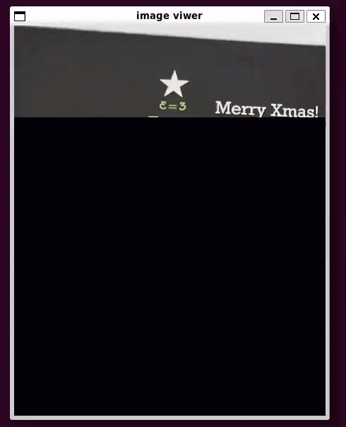

# Image Viewer (PPM Format)

## 📖 Overview
This project implements a simple image viewer in **C++**.  
It reads a `.ppm` file (Portable Pixmap format), loops through pixel coordinates, and displays each pixel’s RGB value on the screen.

---

## 🔬 Technical Background
- **PPM Format**: Stores image data in plain text or binary with pixel values in RGB.  
- **Algorithm**:
  1. Read header (`P3` or `P6`, width, height, max color value).  
  2. Loop over each pixel coordinate `(x, y)`.  
  3. Extract RGB values.  
  4. Render pixel on screen using SDL.

---

## ⚙️ Technologies
- **C++** — file I/O and pixel processing  
- **SDL3** — rendering pixels to screen  

---

## 🎨 Demo


---

## 🚀 How to Run
```bash
g++ iv.cpp -o iv `pkg-config --cflags --libs sdl3`
./iv sample.ppm
